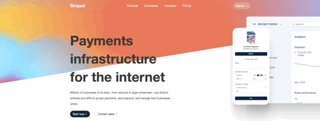

# Striped Landing Page | Next JS

Lading Page built with Next js framework of React,  
I worked with the UI of the educational programming platform [leonidasesteban.com](https://leonidasesteban.com/)
My idea is to bring this landing page to life with subtle animations and make the most of my css skills. Also to make components re usable.

## Screenshoot 📸



## Deploy 👀

[see proyect](https://striped-nextjs.vercel.app/)

## Technologies 🧰

- Next js
- Styled Components
- Framer Motion
- Vercel

## Run proyect 👾

1. First clone project

```
  git clone https://github.com/volta2016/striped-nextjs.git
```

2. Then Install dependencies

```
  yarn install or npm install
```

3. Run proyect in development

```
  yarn dev or npm run dev
```

## Contact

- [Portafolio](https://voltauxui.cl/)
